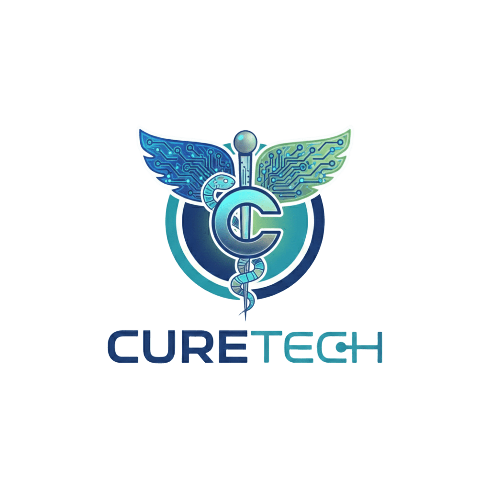

# CureTech

<div align="center">



# AI-Powered Medical Report Analyzer

Transform complex medical reports into interactive health insights using AI, OCR, and modern healthcare analytics.

---


### 🚀 Live Demo

Replace with your deployed Vercel URL

```bash
https://share.google/5xPE6jAYTf18yMTGx
```

</div>

---

# 📌 Overview

CureTech is an AI-powered medical report analyzer designed to simplify healthcare understanding through modern dashboards, OCR processing, and intelligent health insights.

Users can upload medical reports and receive:
- AI-generated summaries
- Biomarker analysis
- Health score insights
- Interactive dashboards
- Smart abnormality detection

---

# ✨ Features

## 🧠 AI Health Insights
- AI-generated medical summaries
- Smart abnormality detection
- Personalized health insights
- Health scoring system

## 📊 Interactive Dashboards
- Color-coded biomarker cards
- Animated analytics
- Deep-dive parameter analysis
- Interactive charts

## 📄 OCR & Report Processing
- PDF and image uploads
- OCR extraction pipeline
- Smart biomarker parsing
- Automatic parameter recognition

## 🔐 Authentication
- JWT-based authentication
- Secure password hashing
- Protected routes
- User profile system

---

# 🧪 Supported Reports

| Report Type | Parameters |
|---|---|
| Blood / CBC | Hb, RBC, WBC, Platelets |
| Liver Function Test | SGPT, SGOT, Bilirubin |
| Kidney Function Test | Creatinine, Urea |
| Thyroid Profile | TSH, T3, T4 |
| Urine Analysis | Protein, Glucose, pH |

---

# 🛠️ Tech Stack

## Frontend
- React 18
- Vite
- Tailwind CSS
- Framer Motion
- Recharts

## Backend
- FastAPI
- Python
- JWT Authentication
- bcrypt
- Uvicorn

## OCR
- pdfplumber
- pytesseract

---

# 📂 Project Structure

```bash
curetech-project-main/
│
├── frontend/
├── backend/
├── README.md
└── .gitignore
```

---

# ⚙️ Local Setup

## Frontend

```bash
cd frontend
npm install
npm run dev
```

Frontend:
```bash
http://localhost:5173
```

---

## Backend

```bash
cd backend

python -m venv venv
```

### Activate Environment

#### Windows
```bash
venv\Scripts\activate
```

#### Mac/Linux
```bash
source venv/bin/activate
```

---

### Install Dependencies

```bash
pip install -r requirements.txt
```

---

### Start Server

```bash
uvicorn main:app --reload --port 8000
```

Backend:
```bash
http://127.0.0.1:8000
```

---

# 🔌 API Endpoints

| Method | Endpoint |
|---|---|
| POST | `/auth/signup` |
| POST | `/auth/login` |
| GET | `/auth/profile` |
| POST | `/reports/upload` |
| POST | `/reports/analyze/{id}` |
| GET | `/reports/result/{id}` |

---

# 🎨 UI Highlights

- Modern responsive design
- Smooth Framer Motion animations
- Clean medical dashboard UI
- Interactive report analytics

---

# 🚀 Future Scope

- AI chatbot integration
- Mobile app
- Doctor consultation system
- Multi-language support

---

# 👨‍💻 Team

| Name | Role |
|---|---|
| Aditya Pagariya | Full Stack Developer |
| Omkar Patange | Backend Developer |
| Sohel Sayyed | QA & Testing |

---

# ⚠️ Disclaimer

CureTech provides AI-assisted analysis for informational purposes only and does not replace professional medical advice.

---

# 📬 Contact

Email: adityapagariya1906@gmail.com

LinkedIn:
https://www.linkedin.com/in/aditya-pagariya-45545a328

---

<div align="center">

## Built with ❤️ by Team CureTech

Making medical reports easier to understand through AI.

</div>
